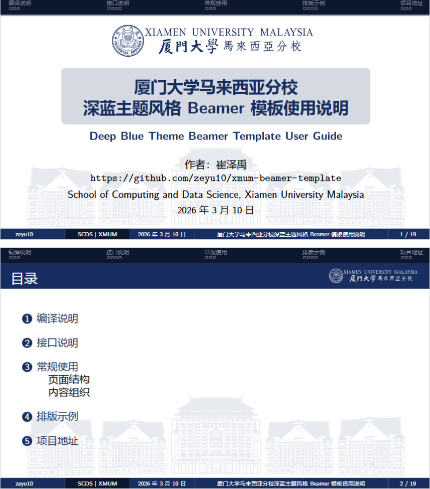
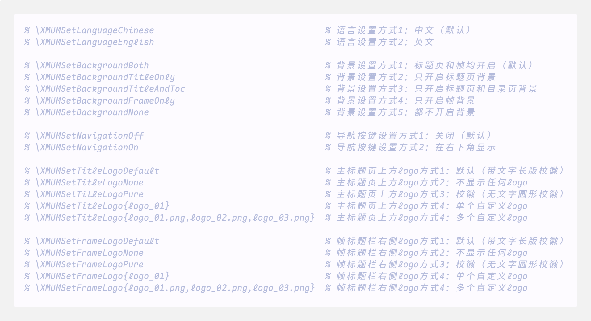
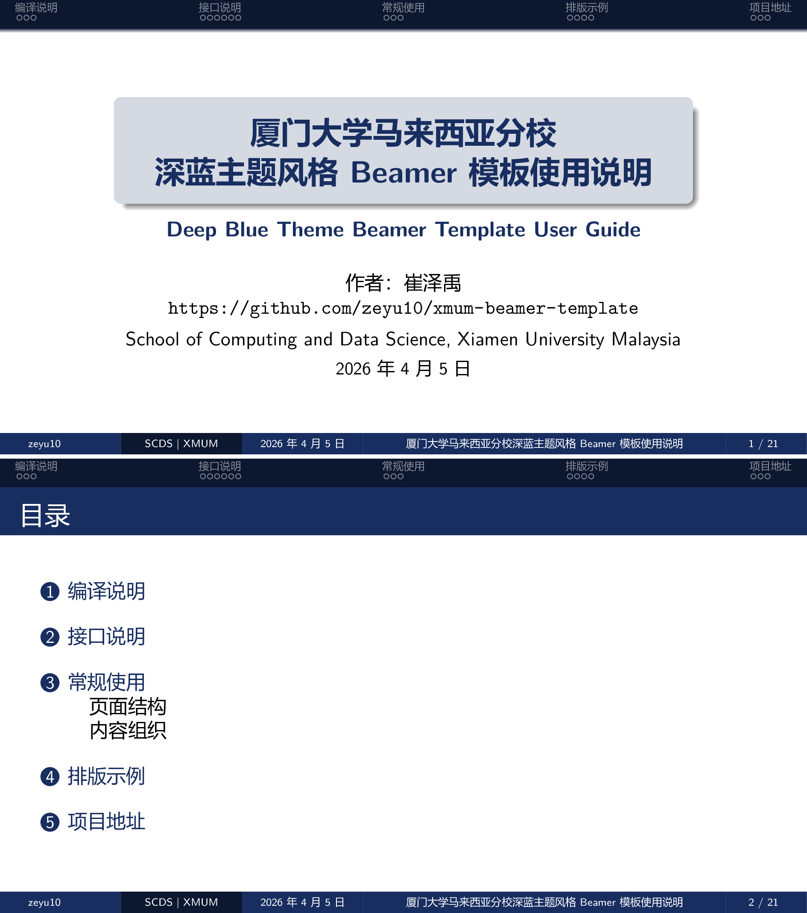
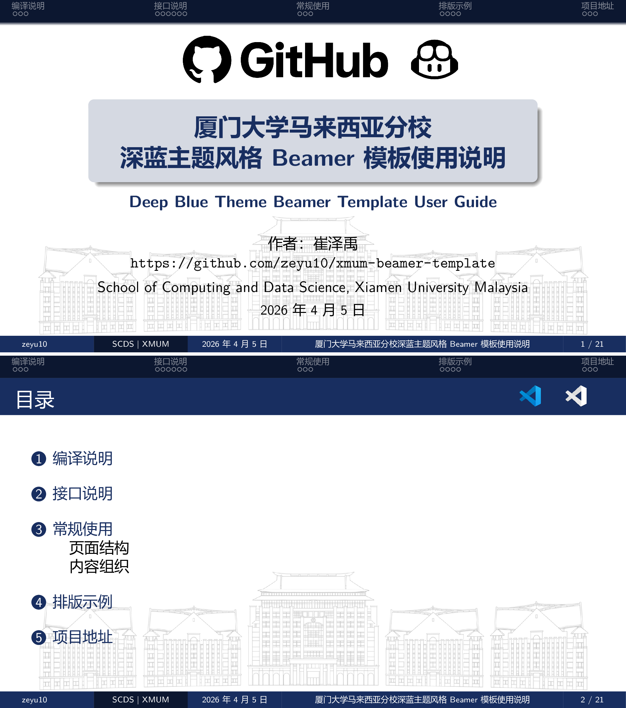
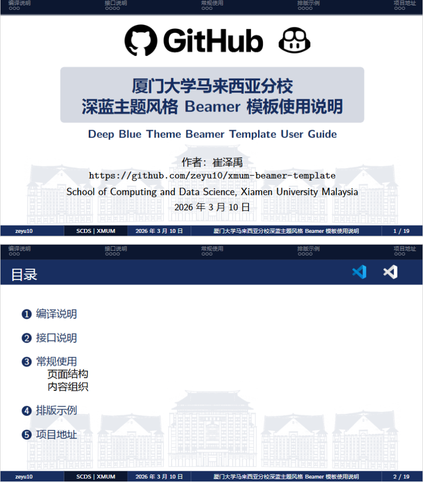

# 厦门大学马来西亚分校深蓝主题风格 Beamer 模板 / Deep Blue Theme Beamer Template for Xiamen University Malaysia



这是一个面向厦门大学马来西亚分校场景的 Beamer 模板，主色为深蓝色，适合课程汇报、学术报告、项目答辩、相关会议等演示文稿。

- 模板核心样式模板：[xmum_beamer.sty](xmum_beamer.sty)
- 完整示例文档参考：[xmum_beamer_readme.tex](xmum_beamer_readme.tex)
- 渲染后的参考文档：[xmum_beamer_readme.pdf](xmum_beamer_readme.pdf)

## 模板特性

- 深蓝主视觉风格，适配学校展示场景。
- 背景图为学校 A 区主群楼，支持自定义替换。
- 支持标题页背景图与正文页背景图的独立控制。
- 支持为单页关闭背景图。
- 支持标题页 Logo 与帧页 Logo 的默认、纯校徽、自定义、多 Logo 配置。
- 支持导航按键的开关设置。
- 支持中文、英文界面文本切换。
- 提供标题页、目录页、代码块、信息块、公式、表格等常见排版示例。

## 使用说明

文档示例默认基于 `ctexbeamer` 文类编写，因此中文环境建议使用 XeLaTeX 编译。

文档默认 `logo` 文件夹路径与 `.tex` 文件同级，最小使用示例：

```tex line-numbers
\documentclass[aspectratio=169,11pt]{ctexbeamer}

\usepackage[T1]{fontenc}
\usepackage{xmum_beamer}

\title[标题]{演示文稿标题}
\author[Your Name]{作者}
\institute[XMUM]{Xiamen University Malaysia}
\date{\today}

\begin{document}

\XMUMSetLogoPath{logo}
\XMUMSetBackgroundImage{xmum_building_blue.png}
\XMUMSetBackgroundOpacity{0.10}

\XMUMTitleFrame

\begin{frame}{目录}
    \tableofcontents
\end{frame}

\begin{frame}{示例页面}
    这是一个最小使用示例。
\end{frame}

\begin{frame}[nobg]{关闭背景示例}
    这是一个关闭背景示例。
\end{frame}

\end{document}
```

如果文档没有调用额外的 `.bib` 文件，直接连续编译两次即可：

```bash
xelatex your_file.tex
xelatex your_file.tex
```

如果文档引用了 `.bib` 文件，则按以下顺序编译：

```bash
xelatex your_file.tex
bibtex your_file
xelatex your_file.tex
xelatex your_file.tex
```

也可以使用以下工具完成编译：

- [TeXstudio](https://texstudio.sourceforge.net)
- [Overleaf](https://www.overleaf.com/project)
- VS Code + [LaTeX Workshop](https://marketplace.visualstudio.com/items?itemName=James-Yu.latex-workshop)
- VS Code 配置请参考：[https://zhuanlan.zhihu.com/p/166523064](https://zhuanlan.zhihu.com/p/166523064)

## 接口说明

### 基础资源

| 命令 | 作用 |
| --- | --- |
| `\XMUMSetLogoPath{path}` | 设置图像目录（默认 [logo](logo/)） |
| `\XMUMSetLogoBlue{file}` | 设置深色 Logo 文件名（默认 [xmum_logo_new_blue.png](logo/xmum_logo_new_blue.png)） |
| `\XMUMSetLogoWhite{file}` | 设置浅色 Logo 文件名（默认 [xmum_logo_new_white.png](logo/xmum_logo_new_white.png)） |
| `\XMUMSetBackgroundImage{file}` | 设置背景图片（默认 [xmum_building_blue.png](logo/xmum_building_blue.png)） |
| `\XMUMSetBackgroundOpacity{v}` | 设置背景透明度（0 到 1，默认为 0.10） |

### 背景控制

| 命令 | 作用 |
| --- | --- |
| `\XMUMSetBackgroundBoth` | 标题页和帧均开启背景（默认） |
| `\XMUMSetBackgroundTitleOnly` | 只开启标题页背景 |
| `\XMUMSetBackgroundTitleAndToc` | 只开启标题页和目录页背景 |
| `\XMUMSetBackgroundFrameOnly` | 只开启帧背景 |
| `\XMUMSetBackgroundNone` | 都不开启背景 |

### 界面设置

| 命令 | 作用 |
| --- | --- |
| `\XMUMSetNavigationOff` | 关闭导航按键（默认） |
| `\XMUMSetNavigationOn` | 在右下角显示导航按键 |

### 标题页 Logo

| 命令 | 作用 |
| --- | --- |
| `\XMUMSetTitleLogoDefault` | 使用默认长版校徽 |
| `\XMUMSetTitleLogoNone` | 不显示标题页 Logo |
| `\XMUMSetTitleLogoPure` | 使用纯校徽图标 |
| `\XMUMSetTitleLogo{logo_01.png,logo_02.png,...}` | 设置一个或多个自定义 Logo |

### 帧标题 Logo

| 命令 | 作用 |
| --- | --- |
| `\XMUMSetFrameLogoDefault` | 使用默认长版校徽 |
| `\XMUMSetFrameLogoNone` | 不显示帧标题 Logo |
| `\XMUMSetFrameLogoPure` | 使用纯校徽图标 |
| `\XMUMSetFrameLogo{logo_01.png,logo_02.png,...}` | 设置一个或多个自定义 Logo |

### 语言设置

| 命令 | 作用 |
| --- | --- |
| `\XMUMSetLanguageChinese` | 设置界面语言为中文（默认） |
| `\XMUMSetLanguageEnglish` | 设置界面语言为英文 |

### 页面生成

| 命令 | 作用 |
| --- | --- |
| `\XMUMTitleFrame` | 生成无页码标题页 |

### 快速使用

可取消对应位置的注释来调用该接口：



### 接口示例

| 默认长版校徽 | 使用圆形校徽 |
| :---: | :---: |
| 开启背景关闭导航按键 | 关闭背景开启导航按键 |
|  |  |

| 不显示任何 Logo | 使用自定义 Logo |
| :---: | :---: |
| 关闭背景关闭导航按键 | 开启背景关闭导航按键 |
|  |  |

## 常规使用建议

推荐按以下结构组织文稿：

1. 在导言区设置标题、作者、单位、日期等元数据。
2. 在 `\begin{document}` 后调用模板接口，例如 Logo、背景、导航和语言设置。
3. 使用 `\XMUMTitleFrame` 生成标题页。
4. 单独插入目录页。
5. 使用 `\section`、`\subsection` 和多个 `frame` 组织正文。
6. 某一页不需要背景时，使用 `[nobg]` 参数。
7. 某一页包含 `lstlisting` 或 `verbatim` 等原样环境时，使用 `[fragile]` 或 `[fragile,nobg]` 参数。

示例：

```tex
\begin{frame}[fragile,nobg]{代码帧示例}
\begin{lstlisting}
#include <bits/stdc++.h>
using namespace std;

int main() {
    cout << "Hello, World!" << endl;
    return 0;
}
\end{lstlisting}
\end{frame}
```

## 项目地址

- 模板地址：[https://github.com/zeyu10/xmum-beamer-template](https://github.com/zeyu10/xmum-beamer-template)
- 参考项目：[https://github.com/tuna/THU-Beamer-Theme](https://github.com/tuna/THU-Beamer-Theme)
- 参考项目：[https://github.com/iceduu/xmu-beamer](https://github.com/iceduu/xmu-beamer)

## 已知问题

- 在部分 PDF 阅读器（MS Edge）中，全屏模式下最后一页的导航栏可能无法完整显示。
- 如遇显示异常，建议改用其他 PDF 阅读器，例如 [WPS PDF 独立版](https://www.wps.cn/product/kingsoftpdf)。

---

感谢阅读和使用此模板，祝愿马校生活愉快。
