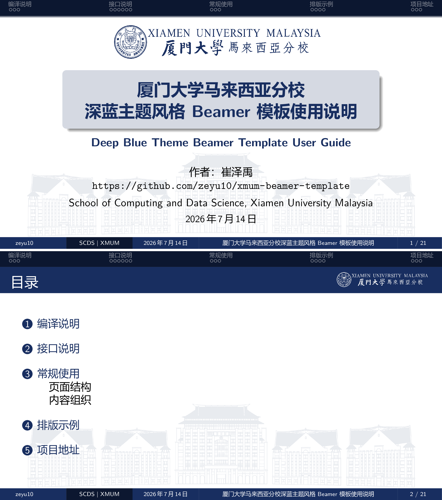
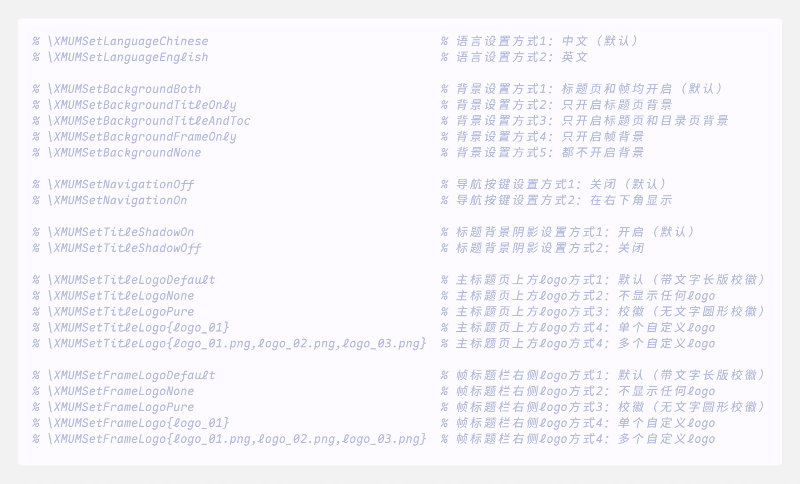
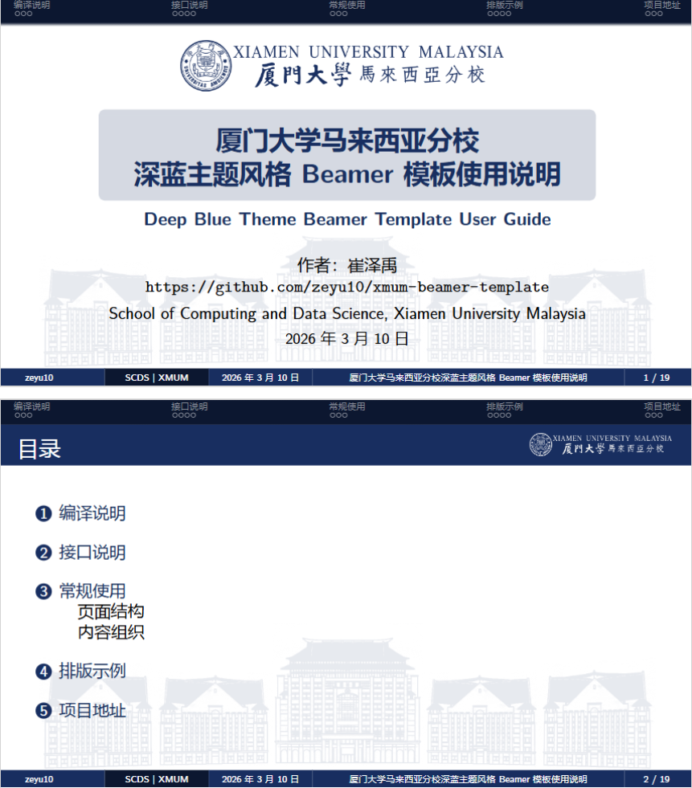
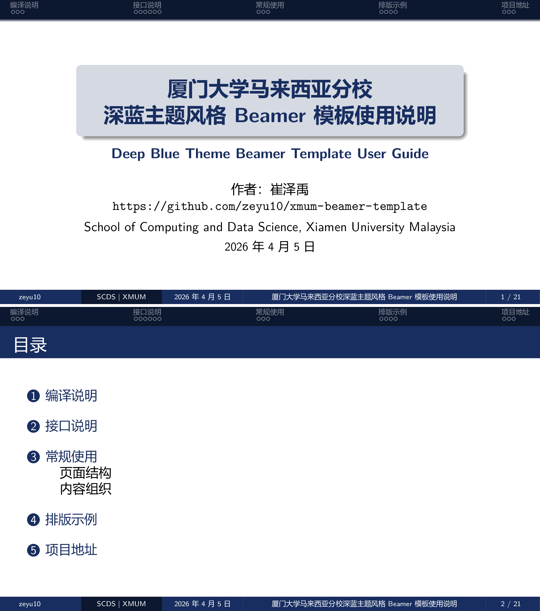
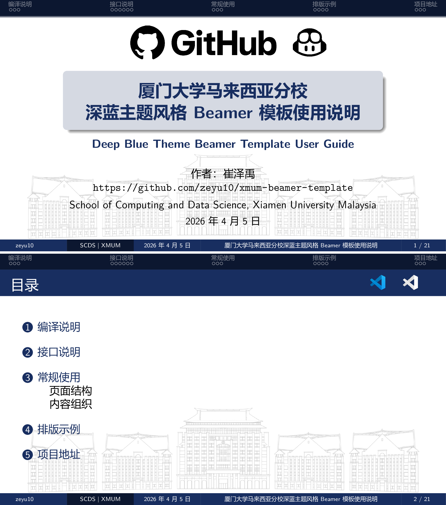

# Xiamen University Malaysia Deep Blue Theme Beamer Template


[简体中文](README.md) | [English](README_EN.md)



This repository provides a Beamer template tailored for Xiamen University Malaysia. It uses a deep blue visual style and is suitable for course presentations, academic reports, project defenses, and conference slides.

- Core style file: [xmum_beamer.sty](xmum_beamer.sty)
- Full example source: [xmum_beamer_readme.tex](xmum_beamer_readme.tex)
- Rendered reference PDF: [xmum_beamer_readme.pdf](xmum_beamer_readme.pdf)

## Features

- Deep blue visual theme adapted for campus presentations.
- Background image based on the main building of A Block at XMUM, with support for custom replacement.
- Independent control for title-slide and content-slide backgrounds.
- Support for disabling the background on a per-slide basis.
- Title logo and frame logo presets, including default, pure emblem, custom, and multi-logo configurations.
- Navigation button toggle.
- Chinese and English interface language switch.
- Example layouts for title slides, table of contents, code blocks, info blocks, formulas, and tables.

## Usage

The example document is based on the `ctexbeamer` class, so XeLaTeX is recommended for Chinese-capable environments.

The default `logo` directory is expected to be at the same level as the `.tex` file. A minimal example:

```tex
\documentclass[aspectratio=169,11pt]{ctexbeamer}

\usepackage[T1]{fontenc}
\usepackage{xmum_beamer}

\title[Title]{Presentation Title}
\author[Your Name]{Author}
\institute[XMUM]{Xiamen University Malaysia}
\date{\today}

\begin{document}

\XMUMSetLogoPath{logo}
\XMUMSetBackgroundImage{xmum_building_blue.png}
\XMUMSetBackgroundOpacity{0.10}

\XMUMTitleFrame

\begin{frame}{Contents}
    \tableofcontents
\end{frame}

\begin{frame}{Example Slide}
    This is a minimal usage example.
\end{frame}

\begin{frame}[nobg]{Background Disabled}
    This slide has the background disabled.
\end{frame}

\end{document}
```

If the document does not use an additional `.bib` file, compile it twice:

```bash
xelatex your_file.tex
xelatex your_file.tex
```

If the document uses a `.bib` file, compile in this order:

```bash
xelatex your_file.tex
bibtex your_file
xelatex your_file.tex
xelatex your_file.tex
```

You can also build the document with the following tools:

- [TeXstudio](https://texstudio.sourceforge.net)
- [Overleaf](https://www.overleaf.com/project)
- VS Code + [LaTeX Workshop](https://marketplace.visualstudio.com/items?itemName=James-Yu.latex-workshop)
- VS Code configuration reference: [https://zhuanlan.zhihu.com/p/166523064](https://zhuanlan.zhihu.com/p/166523064)

## Interface Reference

### Basic Resources

| Command | Description |
| --- | --- |
| `\XMUMSetLogoPath{path}` | Set the image directory (default: [logo](logo/)) |
| `\XMUMSetLogoBlue{file}` | Set the dark logo file name (default: [xmum_logo_new_blue.png](logo/xmum_logo_new_blue.png)) |
| `\XMUMSetLogoWhite{file}` | Set the light logo file name (default: [xmum_logo_new_white.png](logo/xmum_logo_new_white.png)) |
| `\XMUMSetBackgroundImage{file}` | Set the background image (default: [xmum_building_blue.png](logo/xmum_building_blue.png)) |
| `\XMUMSetBackgroundOpacity{v}` | Set background opacity from 0 to 1, default is 0.10 |

### Background Control

| Command | Description |
| --- | --- |
| `\XMUMSetBackgroundBoth` | Enable background on both title and frame pages by default |
| `\XMUMSetBackgroundTitleOnly` | Enable background only on the title page |
| `\XMUMSetBackgroundTitleAndToc` | Enable background only on the title page and table-of-contents page |
| `\XMUMSetBackgroundFrameOnly` | Enable background only on content frames |
| `\XMUMSetBackgroundNone` | Disable background everywhere |
| `\begin{frame}[nobg]` | Disable the background for the current frame |
| `\begin{frame}[fragile,nobg]` | Disable the background for a frame that contains verbatim-like content |

### UI Settings

| Command | Description |
| --- | --- |
| `\XMUMSetNavigationOff` | Turn off navigation buttons by default |
| `\XMUMSetNavigationOn` | Show navigation buttons in the lower-right corner |
| `\XMUMSetTitleShadowOn` | Enable the title background shadow by default |
| `\XMUMSetTitleShadowOff` | Disable the title background shadow |

### Title-Slide Logo

| Command | Description |
| --- | --- |
| `\XMUMSetTitleLogoDefault` | Use the default long-form emblem |
| `\XMUMSetTitleLogoNone` | Do not show a title-slide logo |
| `\XMUMSetTitleLogoPure` | Use the pure emblem icon |
| `\XMUMSetTitleLogo{logo_01.png,logo_02.png,...}` | Set one or more custom logos |

### Frame Logo

| Command | Description |
| --- | --- |
| `\XMUMSetFrameLogoDefault` | Use the default long-form emblem |
| `\XMUMSetFrameLogoNone` | Do not show a frame title logo |
| `\XMUMSetFrameLogoPure` | Use the pure emblem icon |
| `\XMUMSetFrameLogo{logo_01.png,logo_02.png,...}` | Set one or more custom logos |

### Language Settings

| Command | Description |
| --- | --- |
| `\XMUMSetLanguageChinese` | Set the interface language to Chinese by default |
| `\XMUMSetLanguageEnglish` | Set the interface language to English |

### Page Generation

| Command | Description |
| --- | --- |
| `\XMUMTitleFrame` | Generate the title slide |
| `\XMUMSingleLineFrame[true/false]{title}{text}` | Generate a single-line content slide, with an optional switch for the background style |

### Quick Start

You can uncomment the corresponding lines in the example source to call these interfaces:



### Interface Examples

| Default long-form emblem | Pure emblem |
| :---: | :---: |
| Background enabled, navigation disabled | Background disabled, navigation enabled |
|  |  |

| No logo | Custom logo |
| :---: | :---: |
| Background disabled, navigation disabled | Background enabled, navigation enabled |
|  |  |

## Recommended Structure

The following structure is recommended for documents:

1. Set the title, author, institute, date, and other metadata in the preamble.
2. After `\begin{document}`, call the template interfaces such as logo paths, background settings, navigation buttons, and language settings.
3. Use `\XMUMTitleFrame` to generate the title slide, then place a table of contents separately.
4. Organize content with `\section`, `\subsection`, and regular `\begin{frame}{Frame Title}` blocks.
5. Use `\begin{frame}[nobg]{Frame Title}` when a slide does not need a background.
6. If a slide contains `lstlisting` or `verbatim`, use `\begin{frame}[fragile]{Frame Title}` or `\begin{frame}[fragile,nobg]{Frame Title}`.
7. Use `\XMUMSingleLineFrame[true/false]{Frame Title}{Single-line Text}` to create a single-line slide and switch the background style with the optional argument.
8. Use `\XMUMSingleLineFrame[true]{Frame Title}{Single-line Text}` to keep the current template background; use `\XMUMSingleLineFrame[false]{Frame Title}{Single-line Text}` or simply `\XMUMSingleLineFrame{Frame Title}{Single-line Text}` for the colored background.
9. The default font size for the single-line text is `\LARGE`, and you can adjust it in the body if needed.

You can also refer to [xmum_beamer_readme.tex](xmum_beamer_readme.tex) for a complete example structure.

Example:

```tex
\begin{frame}[fragile,nobg]{Code Slide Example}

\begin{lstlisting}
#include <bits/stdc++.h>
using namespace std;

int main() {
    cout << "Hello, World!" << endl;
    return 0;
}
\end{lstlisting}

\end{frame}
```

## Project Links

- Template repository: [https://github.com/zeyu10/xmum-beamer-template](https://github.com/zeyu10/xmum-beamer-template)
- Reference project: [https://github.com/tuna/THU-Beamer-Theme](https://github.com/tuna/THU-Beamer-Theme)
- Reference project: [https://github.com/iceduu/xmu-beamer](https://github.com/iceduu/xmu-beamer)

## Known Issues

- In some PDF readers, such as MS Edge, the navigation bar may not be fully visible on the last slide in fullscreen mode.
- If display issues occur, try a different PDF reader. Recommended options are [Adobe Acrobat Reader](https://get.adobe.com/reader), [Sumatra PDF](https://www.sumatrapdfreader.org), or the standalone [WPS PDF](https://www.wps.cn/product/kingsoftpdf).
- Overleaf no longer accepts uploads of unofficial templates. If you want to use this template on Overleaf, the best approach is to download the repository as a `.zip` file locally from GitHub and then upload it to Overleaf.
- When using Overleaf, you may encounter compilation errors because Overleaf defaults to `pdflatex`, while this template requires `xelatex`. Change the compiler in the Overleaf project settings to `xelatex`, then compile again. You can also add the following line at the top of your `.tex` file:

    ```tex
    % !TeX program = xelatex
    ```

---

Thank you for reading and using this template. Best wishes for a great time at XMUM.
